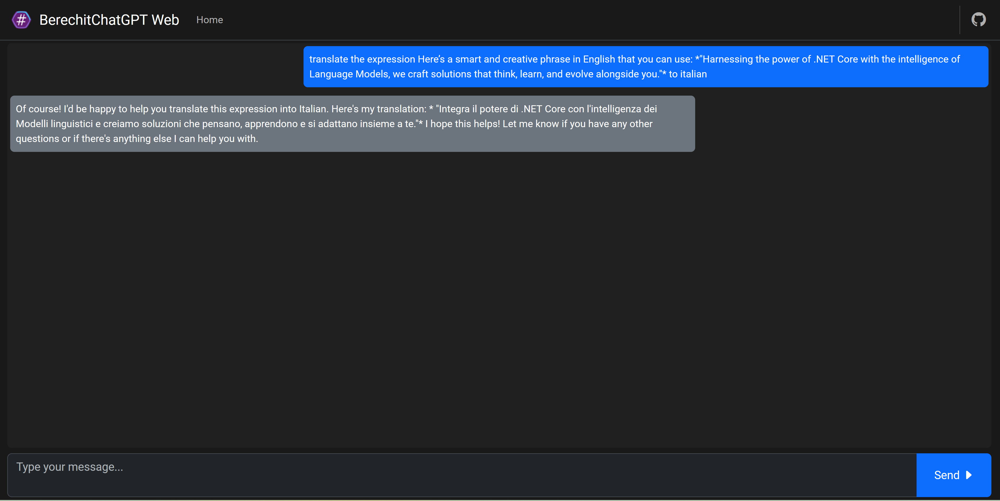

# BerechitChatGPT

Welcome to **BerechitChatGPT**, a .NET Core 8 project designed to demonstrate the functionality of **LLamaSharp** and its potential for integrating and customizing AI models locally. This project provides an interactive chat experience using Large Language Models (LLMs) similar to ChatGPT.

## Overview

BerechitChatGPT is an educational project that showcases how LLamaSharp can be used to create a local chat interface powered by LLMs. The system supports models like Llama-2, offering a platform for experimentation with state-of-the-art natural language processing (NLP) techniques.

## Key Features

- **Local LLM Deployment**: The chat system runs large language models locally, ensuring privacy and control over the data.
- **Interactive Chat Interface**: Users can engage in conversations with the model, fine-tuned for tasks like translation and providing linguistic insights.
- **Demonstration of LLamaSharp Integration**: This project serves as a demonstration of how LLamaSharp can be integrated into .NET applications for customized AI solutions.

## Prerequisites

To run this project, you need to download the Llama-2 model file from [Hugging Face](https://huggingface.co/):

- **Model File**: `llama-2-7b-chat.Q4_0.gguf` (or another model in `gguf` format).
- Make sure the option to "Copy always to output directory" is selected in your project settings.

## Configuration

The model file path can be configured in the `appsettings.json` file. The default configuration is:

```json
{
  "Logging": {
    "LogLevel": {
      "Default": "Information",
      "Microsoft.AspNetCore": "Warning"
    }
  },
  "AllowedHosts": "*",
  "ModelPath": "llama-2-7b-chat.Q4_0.gguf"
}
```

You can change the `"ModelPath"` to point to a different model file, as long as it is in the `gguf` format.

### Understanding the GGUF Format

The `gguf` format is a specialized format used for large language models like Llama. It stands for "Grokking Grouped Universal Format" and is designed to efficiently store and manage the vast amount of data required for LLMs. This format optimizes the loading and processing of model data, ensuring that large models can be used effectively in resource-constrained environments.

## Libraries Used

This project utilizes the following libraries:

- [**LLamaSharp**](https://github.com/SciSharp/LLamaSharp/) - Version 0.15.0
- **LLamaSharp.Backend.Cpu** - Version 0.15.0

## Getting Started

1. **Clone the Repository**:
   ```bash
   git clone https://github.com/yourusername/BerechitChatGPT.git
   cd BerechitChatGPT
   ```

2. **Install Dependencies**:
   Install the required NuGet packages by running:
   ```bash
   dotnet restore
   ```

3. **Download the Model**:
   Download the model `llama-2-7b-chat.Q4_0.gguf` from [Hugging Face](https://huggingface.co/) and place it in the appropriate directory within your project. Ensure that the file is set to "Copy always" in the output directory settings.

4. **Run the Project**:
   ```bash
   dotnet run
   ```

   

## How It Works

### JavaScript Functionality

The JavaScript code in the `Index` view facilitates user interaction with the chat system. It captures user input, sends it to the server via an AJAX POST request, and displays the server's response in the chat interface. The script ensures smooth user experience by showing a loading overlay during processing and handling errors gracefully.

### StatefulChatService Detailed Explanation

The `StatefulChatService` is a critical component of the BerechitChatGPT project. It manages the chat session and interfaces with the LLama model to generate responses based on user input. Here’s a detailed breakdown of its functionality:

#### 1. **ContextSize**

```csharp
var @params = new LLama.Common.ModelParams(configuration["ModelPath"]!)
{
    ContextSize = 512,
};
```

- **ContextSize** defines the amount of past conversation that the model will consider when generating a response. A larger `ContextSize` allows the model to retain more of the conversation history, making it capable of maintaining context over longer interactions. In this project, it is set to 512 tokens, which is a balance between memory usage and the ability to maintain coherent conversations.

#### 2. **Session Initialization**

```csharp
_session = new ChatSession(new InteractiveExecutor(_context));
_session.History.AddMessage(LLama.Common.AuthorRole.System, SystemPrompt);
```

- The `ChatSession` object is initialized with an `InteractiveExecutor`, which handles the interaction between the user inputs and the LLM. 
- The `SystemPrompt` is added to the session history as a system-level message, setting the tone and rules for the conversation. This prompt instructs the model on how to behave, ensuring that it provides responses that align with the desired behavior, such as being a linguistic specialist.

#### 3. **Message Processing and Inference**

```csharp
var outputs = _session.ChatAsync(
    new LLama.Common.ChatHistory.Message(LLama.Common.AuthorRole.User, input.Text),
    new LLama.Common.InferenceParams()
    { 
        AntiPrompts = new string[] { "User:" },
    });
```

- The `ChatAsync` method processes the user's input and generates a response from the model. 
- The `InferenceParams` includes `AntiPrompts`, which are cues that help the model understand where the user input ends and the model's response should begin. This prevents the model from inadvertently repeating user inputs and helps maintain a clear separation between the user and the model's roles in the conversation.

#### 4. **Streaming Output**

```csharp
var result = "";
await foreach (var output in outputs)
{
    _logger.LogInformation("Message: {output}", output);
    result += output; 
}
```

- The model’s response is streamed asynchronously, allowing the application to handle large outputs efficiently. This is particularly useful when the model generates lengthy responses.
- Each chunk of the response is logged and appended to the `result`, which is then returned as the final output of the chat session.

## Understanding LLMs and LLamaSharp

### What are LLMs?

Large Language Models (LLMs) are advanced machine learning models designed to understand and generate human-like text based on vast amounts of data. They are foundational in many modern NLP applications, including translation, summarization, and conversational agents.

### Role of LLamaSharp

LLamaSharp is a C# library that enables the deployment and interaction with LLMs in .NET environments. It allows developers to integrate powerful language models into their applications, supporting both CPU and GPU execution.

## Contributing

We welcome contributions to enhance the capabilities of BerechitChatGPT. Please submit your pull requests, and feel free to open issues for any bugs or feature requests.


## License

This project is licensed under the MIT License. See the LICENSE file for details.

## Keywords

`#LLM`, `#Chatbot`, `#MachineLearning`, `#AI`, `#LLamaSharp`, `#DotNet`, `#CSharp`, `#NaturalLanguageProcessing`, `#HuggingFace`, `#CHATGPT`
## Connect with Me

Let's connect on LinkedIn:

[Anderson Meneses on LinkedIn](https://www.linkedin.com/in/anderson-meneses)

## Medium
[Article on Medium](https://medium.com/@anderson.meneses/asp-net-core-8-with-llms-a-practical-example-with-berechitchatgpt-d52189fc5df2)

## License

This project is licensed under the MIT License. See the [LICENSE](LICENSE) file for details.


